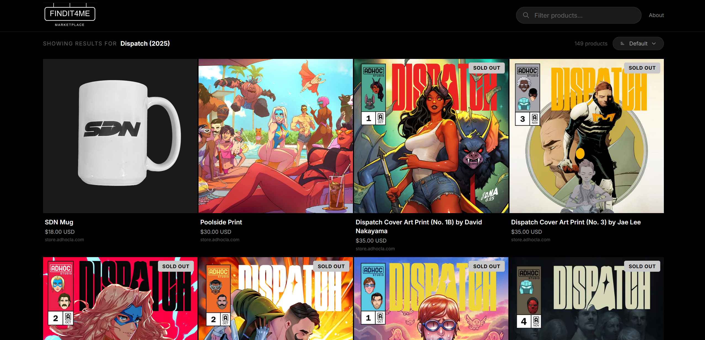
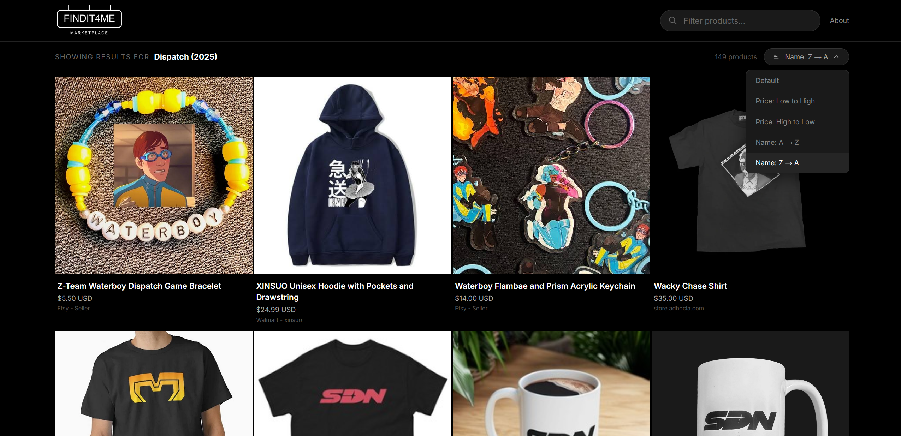

# FINDIT4ME

A product aggregator that finds merchandise across multiple online retailers. Search for a brand, browse what's available, sort by price or name, and click to buy directly from the store.

Currently pre-loaded with **Dispatch** (2025 video game by AdHoc Studio) merchandise from the official Shopify store, eBay, Redbubble, Displate, Etsy, and more.


---

<p align="center">
  
</p>

<p align="center">
  
</p>

---

## Features

- **Multi-retailer aggregation** — Products from Shopify stores, eBay, and Google Shopping (via SerpAPI) in one place
- **Sort & filter** — Sort by price (low/high), name (A-Z/Z-A), or the default order. Filter products with the search bar.
- **Direct purchase links** — Every product links straight to the retailer's page in a new tab
- **Stock status** — "Sold Out" badges on unavailable items with dimmed styling
- **Responsive grid** — 4 columns on desktop, 3 on tablet, 2 on mobile
- **Daily refresh** — GitHub Action updates product data every day at 6 AM UTC
- **Graceful degradation** — Works with zero API keys (serves pre-loaded data), progressively better with each key added

## Tech Stack

| Layer | Technology |
|-------|-----------|
| Framework | Next.js 16 (App Router) + TypeScript |
| Styling | Tailwind CSS v4 |
| Hosting | Vercel (free tier) |
| Caching | Upstash Redis |
| Product search | SerpAPI (Google Shopping), eBay Browse API, Shopify `/products.json` |

## Getting Started

### Prerequisites

- Node.js 20+
- npm

### Installation

```bash
git clone https://github.com/Konsing/FINDIT4ME.git
cd FINDIT4ME
npm install
```

### Environment Variables

Copy the example env file and fill in any keys you have:

```bash
cp .env.example .env.local
```

| Variable | Required | Description |
|----------|----------|-------------|
| `SERPAPI_KEY` | No | SerpAPI key for Google Shopping results (250 free searches/month) |
| `EBAY_CLIENT_ID` | No | eBay developer app ID (production keyset) |
| `EBAY_CLIENT_SECRET` | No | eBay developer secret (production keyset) |
| `UPSTASH_REDIS_REST_URL` | No | Upstash Redis URL for search result caching |
| `UPSTASH_REDIS_REST_TOKEN` | No | Upstash Redis token |
| `SHOPIFY_STORES` | No | Comma-separated Shopify store domains (default: `store.adhocla.com`) |

> **None of the keys are required to run the app.** Without them, the site serves pre-loaded Dispatch products. Each key you add enables an additional data source.

### Development

```bash
npm run dev
```

Open [http://localhost:3000](http://localhost:3000).

### Refresh Product Data

To manually re-scrape all sources and update the default product data:

```bash
npx tsx scripts/refresh-default-data.ts
```

This requires `SERPAPI_KEY`, `EBAY_CLIENT_ID`, and `EBAY_CLIENT_SECRET` to be set in your environment.

## Data Sources

| Source | Method | Queries | Free Tier |
|--------|--------|---------|-----------|
| Shopify | `/products.json` endpoint | AdHoc Studio store | Unlimited |
| SerpAPI | Google Shopping API | Dispatch Merch, Displate, Etsy, Adhoc Studio, Redbubble | 250 searches/month |
| eBay | Browse API (OAuth) | dispatch adhoc, clothing, SDN, video game merch | No explicit limit |

Products are deduplicated by ID across all sources and filtered to remove unrelated results (e.g. 911/emergency dispatch items).

## Project Structure

```
src/
├── app/
│   ├── layout.tsx              # Root layout (dark theme, fonts, metadata)
│   ├── page.tsx                # Main page (search, sort state, component assembly)
│   ├── globals.css             # Tailwind imports
│   └── api/
│       ├── products/route.ts   # Product API (cache-first, fallback to scrape)
│       └── scrape/route.ts     # Raw scraping endpoint
├── components/
│   ├── Header.tsx              # Logo + search bar + about link
│   ├── SearchBar.tsx           # Filter input with debounce
│   ├── BrandBar.tsx            # Brand label + product count + sort dropdown
│   ├── SortDropdown.tsx        # Sort-by dropdown (price, name, default)
│   ├── ProductGrid.tsx         # Responsive grid with configurable sorting
│   ├── ProductCard.tsx         # Product display with stock status
│   ├── LoadingState.tsx        # Skeleton loading cards
│   ├── ErrorState.tsx          # Error display with retry
│   ├── Footer.tsx              # Disclaimer
│   └── AboutModal.tsx          # About dialog
├── lib/
│   ├── types.ts                # TypeScript interfaces
│   ├── cache.ts                # Upstash Redis cache helpers
│   ├── useSearch.ts            # Client-side filter hook
│   └── scrapers/
│       ├── shopify.ts          # Shopify store scraper
│       ├── ebay.ts             # eBay Browse API client
│       ├── google.ts           # SerpAPI Google Shopping client
│       └── index.ts            # Parallel scraper orchestrator
├── data/
│   └── dispatch.json           # Pre-scraped default products (~150 items)
scripts/
└── refresh-default-data.ts     # Daily refresh script (Shopify + SerpAPI + eBay)
```

## API

### `GET /api/products?q=<query>`

Returns products for a query. Serves cached results when available.

- No query or `q=dispatch` → returns pre-loaded Dispatch products
- Any other query → checks cache → scrapes if miss → caches for 24h

### `GET /api/scrape?q=<query>`

Raw scraping endpoint. Always scrapes fresh (no cache). Query must be 2-100 characters.

## License

MIT
